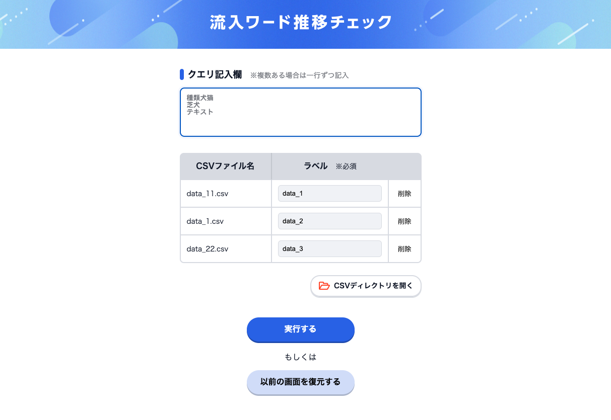
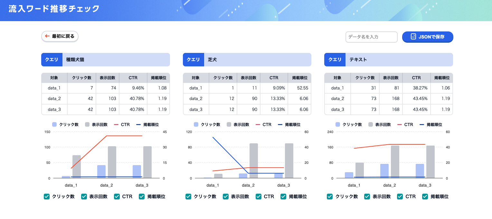

# graph app

このリポジトリは
サーチコンソールで取得できるcsvのクエリを
グラフごとにグラフ表示するものです。  

「csvファイル」というフォルダ内にあるcsvを読み込み  
中に記述されているクエリを指定するとクエリごとのグラフが表示されます。  



**使用技術：** Vue.js, PHP

```markdown
.
├── csvファイル          // 試し用データ
└── src
    ├── assets          // 静的アセット
    ├── main.js         // エントリーポイント
    ├── App.vue         // アプリのルートコンポーネント
    ├── components      // コンポーネント
    ├── router          // ルーティング
    ├── store           // 状態管理
    └── views           // ページの画面表示
```

基本コードは「src」フォルダ内にあり、  
機能ごとにフォルダおよびファイルを分けて作成しております。  
SPAとなっており、main.jsをエントリーポイントとしてApp.vueを経て  
「views」フォルダ内にある各ページ「ホーム画面」「グラフ表示画面」「データリスト画面」の
3画面を表示します。




## プロジェクトのセットアップ

```sh
npm install
```

### 開発環境立ち上げ

```sh
npm run dev
```

### 本番環境ファイル出力

```sh
npm run build
```
